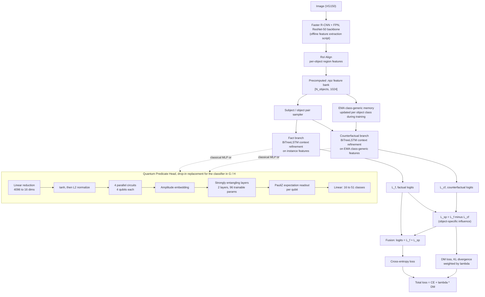

<div align="center">

# QPredSGG

### Hybrid Quantum Predicate Learning for Long-Tailed Scene Graph Generation

[](https://www.python.org/)
[](https://pytorch.org/)
[](https://pennylane.ai/)
[](#quantum-predicate-head-qp-head)
[](#citation)
[](#license)

A Causal Feature Enhancement Network (CFEN) for Scene Graph Generation, with a parameterized quantum circuit swapped in as the predicate classification head and tested on both simulators and real quantum hardware.

[Overview](#overview) · [Architecture](#architecture) · [Quantum Head](#quantum-predicate-head-qp-head) · [Installation](#installation) · [Usage](#usage) · [Repository Structure](#repository-structure) · [Citation](#citation)

</div>

---

## Overview

Scene Graph Generation (SGG) models tend to lean hard on a small set of frequent predicates like "on," "has," or "near," while largely ignoring rarer but more informative relations like "carrying" or "painted on." This repository is our attempt at pushing back on that long-tail bias, using two ideas together:

1. **Causal Feature Enhancement (CFEN):** a fact and counterfactual branch setup that tries to isolate what an object's *specific* features contribute to a predicate prediction, separate from what you'd predict just from knowing its general object class.
2. **A Quantum Predicate Head (QP-Head):** a replacement for the usual MLP predicate classifier, built from a small parameterized quantum circuit (PQC). Context features are amplitude-encoded into qubits, entangled, and measured to produce the logits that feed into the CFEN debiasing objective.

The repo has **both variants side by side**: a classical baseline in `cfen/` and the quantum version in `cfen_quantum_head/`. Both also support a synthetic data generator, so you can run the full training and evaluation loop and confirm everything works before touching the real dataset.

> This is the reference implementation for the manuscript "QPredSGG: Hybrid Quantum Predicate Learning for Long-Tailed Scene Graph Generation," currently being prepared for submission to **IEEE ICTAI**.

---

## Architecture



A few notes on why it's built this way:

- The **fact branch** works from real, instance-specific object features.
- The **counterfactual branch** swaps those out for a slowly-updated, class-generic EMA memory. It's basically asking: what would the model predict if it only knew the object's category, not this particular instance?
- Subtracting the two (`L_sp = L_f - L_cf`) gives you the part of the prediction that's actually driven by the specific object, rather than its category. That difference is fused back with the fact logits and also pushed through a KL-divergence debiasing (DM) loss against the ground-truth predicate distribution, which is where the long-tail correction actually happens.
- The **QP-Head** is a straight swap at the classifier stage of either branch. Classical two-layer MLP on one side, 4-head / 4-qubit parameterized quantum circuit on the other, with the rest of the pipeline held identical so the two are actually comparable.
- Feature extraction (Faster R-CNN + RoI Align) is a separate, offline preprocessing step that runs once and writes `.npz` files per image. It isn't part of the CFEN model's forward pass itself.

---

## Quantum Predicate Head (QP-Head)

The quantum variant lives in [`cfen_quantum_head/models/quantum_circuit.py`](cfen_quantum_head/models/quantum_circuit.py) and [`relation_head.py`](cfen_quantum_head/models/relation_head.py), built on **[PennyLane](https://pennylane.ai/)** with a PyTorch interface.

| Component | Configuration |
|---|---|
| Encoding | `AmplitudeEmbedding`, classical features compressed into probability amplitudes |
| Entanglement | `StronglyEntanglingLayers` (2 layers x 4 qubits x 3 rotation params) |
| Heads | 4 parallel circuits x 4 qubits each, 16-dim combined quantum feature space |
| Readout | Expectation value of PauliZ per wire |
| Trainable quantum params | 96 total (4 heads x 2 layers x 4 qubits x 3) |
| Simulator backend | `default.qubit`, `diff_method="backprop"` |
| Hardware backend | Real device (IBM Q, IonQ), `diff_method="parameter-shift"` |

The flow into the circuit: BiTreeLSTM context vectors for subject and object (2 x 2048-d, concatenated) get linearly reduced to 16 dimensions, passed through `tanh`, L2-normalized, then split across 4 independent 4-qubit circuits. Their outputs are concatenated and projected to the 51 VG predicate classes.

The device is swappable at the code level: `QuantumLayer` accepts either a local simulator or a `qml.device` pointed at real IBM Quantum or IonQ hardware, and switches its differentiation rule automatically, `backprop` on the simulator, `parameter-shift` on real hardware (since you can't backprop through an actual quantum computer).

The commented-out blocks left in `quantum_circuit.py` and `relation_head.py` are from earlier ablation runs (32 heads, 8 qubits, 16 qubits, different layer counts) that were tried before settling on the 4-head, 4-qubit configuration described above. They're kept in the file as a record of what was explored, not as active code paths.

---

## Repository Structure

```
QPredSGG/
├── cfen/                          # Classical CFEN baseline
│   ├── configs/default.yaml       # Synthetic + real-data training config
│   ├── data/sgg_dataset.py        # NPZ-backed and synthetic dataset loaders
│   ├── models/
│   │   ├── cfen.py                # Fact/counterfactual fusion + DM loss
│   │   └── relation_head.py       # BiTreeLSTM context encoder + MLP classifier
│   ├── dataset_prep.py            # Faster R-CNN feature extraction to .npz
│   ├── phase1_test.py             # Standalone pipeline smoke test
│   ├── evaluate.py                # R@K / mR@K evaluation from a checkpoint
│   ├── train.py                   # Training entrypoint
│   ├── how-to-run.pdf             # Setup notes
│   └── utils/                     # Config parsing, metrics, seeding
│
├── cfen_quantum_head/              # Quantum-augmented variant (QP-Head)
│   ├── configs/default.yaml
│   ├── data/sgg_dataset.py
│   ├── models/
│   │   ├── cfen.py
│   │   ├── quantum_circuit.py     # PennyLane multi-head PQC (QuantumLayer)
│   │   └── relation_head.py       # BiTreeLSTM + QP-Head classifier
│   ├── dataset_division.py        # Faster R-CNN feature extraction + train/val/test split
│   ├── phase1-train.py            # Debug run with cosine-annealed LR schedule
│   ├── main_train_script.py       # Full training loop with checkpointing + plots
│   ├── train_plotting.py          # Loss / R@50 curve plotting utilities
│   └── utils/
│
└── README.md
```

---

## Installation

```bash
git clone https://github.com/Prk10/QPredSGG.git
cd QPredSGG

conda create -n qpredsgg python=3.10 -y
conda activate qpredsgg

# Classical baseline dependencies
pip install -r cfen/requirements.txt

# The quantum variant additionally needs PennyLane and a plugin
# for whichever hardware backend you want to target
pip install pennylane
```

---

## Usage

### 1. Quick pipeline check, synthetic data, no dataset download needed

```bash
cd cfen
python train.py --config configs/default.yaml
```

```bash
cd cfen_quantum_head
python main_train_script.py --config configs/default.yaml
```

Both configs default to `DATASET.USE_SYNTHETIC: true`, which generates a small in-memory scene graph dataset (300 synthetic images by default). That's enough to confirm the forward pass, loss, checkpointing, and evaluation loop all work before you spend time on real data.

### 2. Training on real data (Visual Genome / VG150)

1. Get the standard VG150 files: `VG_100K` images, `VG-SGG-with-attri.h5`, and `image_data.json`.
2. Extract per-image RoI features with the Faster R-CNN (ResNet-50-FPN) backbone:
   ```bash
   python cfen_quantum_head/dataset_division.py
   ```
   This writes one `.npz` file per image with the pooled box features.
3. Point `BASE_DIR` / `DATASET.DATA_DIR` in `configs/default.yaml` at your extracted files, and set `DATASET.USE_SYNTHETIC: false`.
4. Start training:
   ```bash
   python main_train_script.py --config configs/default.yaml
   ```

### 3. Running on real quantum hardware

Pass a `qml.device` bound to an IBM Quantum or IonQ backend into `QuantumLayer(q_device=...)` instead of the default `default.qubit` simulator. The circuit picks up `parameter-shift` differentiation automatically once it detects a hardware device.

---

## Evaluation

Two standard SGG long-tail metrics get computed during validation:

- **R@K**, recall at K over all predicted (subject, predicate, object) triplets.
- **mR@K**, mean recall at K, averaged per predicate class instead of pooled across all triplets. This is the metric that actually tells you whether the long tail is being learned, rather than just how well the head classes are doing.

Both are logged per epoch, saved alongside the model and optimizer state in each checkpoint, and plotted automatically to `training_curves.png` in the configured output directory.

