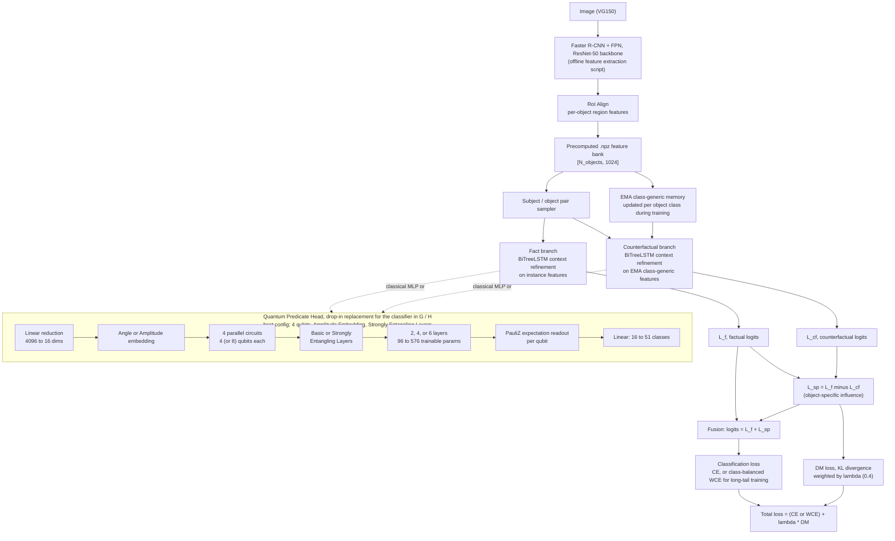

<div align="center">

# QPredSGG

### Hybrid Quantum Predicate Learning for Long-Tailed Scene Graph Generation

[](https://www.python.org/)
[](https://pytorch.org/)
[](https://pennylane.ai/)
[](#quantum-predicate-head-qp-head)
[](#results)
[](#license)

A Causal Feature Enhancement Network (CFEN) for Scene Graph Generation, with a parameterized quantum circuit swapped in as the predicate classification head and tested on both simulators and real quantum hardware.

[Overview](#overview) · [Architecture](#architecture) · [Quantum Head](#quantum-predicate-head-qp-head) · [Installation](#installation) · [Usage](#usage) · [Repository Structure](#repository-structure) · [Evaluation](#evaluation) · [Results](#results) · [License](#license)

</div>

---

## Overview

Scene Graph Generation (SGG) models tend to lean hard on a small set of frequent predicates like "on," "of," or "in," while largely ignoring rarer but more informative relations like "carrying" or "painted on." This repository pushes back on that long-tail bias, using two ideas together:

1. **Causal Feature Enhancement (CFEN):** a fact and counterfactual branch setup that tries to isolate what an object's *specific* features contribute to a predicate prediction, separate from what you'd predict just from knowing its general object class.
2. **A Quantum Predicate Head (QP-Head):** a replacement for the usual MLP predicate classifier, built from a small parameterized quantum circuit (PQC). Context features are amplitude- or angle-encoded into qubits, entangled, and measured to produce the logits that feed into the classification objective.

The repo has **both variants side by side**: a classical baseline in `cfen/` and the quantum version in `cfen_quantum_head/`. Both also support a synthetic data generator, so you can run the full training and evaluation loop and confirm everything works before touching the real dataset.

On Visual Genome 150 under the PredCls setting, the best-tuned QP-Head reaches a peak **mR@100 of 57.25%**, well above the 41.1% reported for the original classical CFEN, while its predicate decision layer runs on a representation that's **128x smaller** than the classical head's and uses as few as **96 trainable quantum parameters**. See [Results](#results) for the full picture, including a protocol-matched comparison that separates the quantum circuit's contribution from the training objective's.

> This is the reference implementation for **[QPredSGG: Hybrid Quantum Predicate Learning for Long-Tailed Scene Graph Generation](https://arxiv.org/abs/2606.04689)** by Prerana Ramkumar (American University of Sharjah), Nouhaila Innan and Muhammad Shafique (NYU Abu Dhabi, eBRAIN Lab and the Center for Quantum and Topological Systems), accepted at IEEE ICTAI 2026.

---

## Architecture



A few notes on why it's built this way:

- The **fact branch** works from real, instance-specific object features.
- The **counterfactual branch** swaps those out for a slowly-updated, class-generic EMA memory. It's basically asking: what would the model predict if it only knew the object's category, not this particular instance?
- Subtracting the two (`L_sp = L_f - L_cf`) gives you the part of the prediction that's actually driven by the specific object, rather than its category. That difference is fused back with the fact logits and also pushed through a KL-divergence debiasing (DM) loss against the ground-truth predicate distribution.
- On top of that, the paper trains with a **class-balanced weighted cross-entropy (WCE)** loss instead of standard CE for the classification term, which is what actually moves the long-tail metric: rare-class gradients get scaled up by inverse class frequency, clipped to a maximum 46x rare-to-frequent weight ratio.
- The **QP-Head** is a swap at the classifier stage of either branch. Encoding (Angle vs Amplitude embedding), entangling template (Basic vs Strongly Entangling Layers), qubit count (4 or 8 per circuit), and depth (2, 4, or 6 layers) are all part of a design-space search in the paper. The diagram above shows the best-performing configuration found: 4 qubits, Amplitude Embedding, Strongly Entangling Layers, 2 layers, 4 parallel circuits, 96 trainable quantum parameters.
- Feature extraction (Faster R-CNN + RoI Align) is a separate, offline preprocessing step that runs once and writes `.npz` files per image. It isn't part of the CFEN model's forward pass itself.

---

## Quantum Predicate Head (QP-Head)

The quantum variant lives in [`cfen_quantum_head/models/quantum_circuit.py`](cfen_quantum_head/models/quantum_circuit.py) and [`relation_head.py`](cfen_quantum_head/models/relation_head.py), built on **[PennyLane](https://pennylane.ai/)** with a PyTorch interface.

The paper searches this design space rather than fixing it:

| Axis | Options explored | Best found |
|---|---|---|
| Qubits per circuit | 4, 8 | 4 (8 scales well too) |
| Encoding | Angle Embedding, Amplitude Embedding | Amplitude |
| Entangling template | Basic Entangling Layers (BEL), Strongly Entangling Layers (SEL) | SEL |
| Circuit depth | 2, 4, 6 layers | 2 layers (4-qubit); 4 layers (8-qubit, best latency/expressibility trade-off) |
| Parallel circuits (heads) | fixed at 4 | 4 |
| Readout | Expectation value of PauliZ per wire, 4 heads x n qubits, then a linear layer to 51 classes | |

The primary, best-performing configuration is **4 qubits, Amplitude Embedding, Strongly Entangling Layers, 2 layers**, giving 96 trainable quantum parameters. BiTreeLSTM context vectors for subject and object (4096-d pair embedding) are linearly reduced to 16 dimensions, then split across 4 independent 4-qubit circuits whose outputs are concatenated and projected to the 51 VG predicate classes.

The device is swappable at the code level: `QuantumLayer` accepts either a local simulator (`default.qubit`, `diff_method="backprop"`) or a `qml.device` pointed at real hardware, switching to `diff_method="parameter-shift"` automatically (since you can't backpropagate through an actual quantum computer). The paper's physical feasibility test ran the 4-qubit, 2-layer configuration on IBM's **ibm_fez** (a 156-qubit Heron r2 processor, native CZ two-qubit gate, 1,024 shots per circuit) against 9 VG-150 validation triplets, correctly classifying 6 of 9 without the predictions collapsing to a single output class.

---

## Repository Structure

```
QPredSGG/
├── cfen/                          # Classical CFEN baseline
│   ├── configs/default.yaml       # Synthetic + real-data training config
│   ├── data/sgg_dataset.py        # NPZ-backed and synthetic dataset loaders
│   ├── models/
│   │   ├── cfen.py                # Fact/counterfactual fusion + DM loss
│   │   └── relation_head.py       # BiTreeLSTM context encoder + MLP classifier
│   ├── dataset_prep.py            # Faster R-CNN feature extraction to .npz
│   ├── phase1_test.py             # Standalone pipeline smoke test
│   ├── evaluate.py                # R@K / mR@K evaluation from a checkpoint
│   ├── train.py                   # Training entrypoint
│   ├── how-to-run.pdf             # Setup notes
│   └── utils/                     # Config parsing, metrics, seeding
│
├── cfen_quantum_head/              # Quantum-augmented variant (QP-Head)
│   ├── configs/default.yaml
│   ├── data/sgg_dataset.py
│   ├── models/
│   │   ├── cfen.py
│   │   ├── quantum_circuit.py     # PennyLane multi-head PQC (QuantumLayer)
│   │   └── relation_head.py       # BiTreeLSTM + QP-Head classifier
│   ├── dataset_division.py        # Faster R-CNN feature extraction + train/val/test split
│   ├── phase1-train.py            # Debug run with cosine-annealed LR schedule
│   ├── main_train_script.py       # Full training loop with checkpointing + plots
│   ├── train_plotting.py          # Loss / R@50 curve plotting utilities
│   └── utils/
│
└── README.md
```

---

## Installation

```bash
git clone https://github.com/Prk10/QPredSGG.git
cd QPredSGG

conda create -n qpredsgg python=3.10 -y
conda activate qpredsgg

# Classical baseline dependencies
pip install -r cfen/requirements.txt

# The quantum variant additionally needs PennyLane and a plugin
# for whichever hardware backend you want to target
pip install pennylane
```

---

## Usage

### 1. Quick pipeline check, synthetic data, no dataset download needed

```bash
cd cfen
python train.py --config configs/default.yaml
```

```bash
cd cfen_quantum_head
python main_train_script.py --config configs/default.yaml
```

Both configs default to `DATASET.USE_SYNTHETIC: true`, which generates a small in-memory scene graph dataset (300 synthetic images by default). That's enough to confirm the forward pass, loss, checkpointing, and evaluation loop all work before you spend time on real data.

### 2. Training on real data (Visual Genome / VG150)

1. Get the standard VG150 files: `VG_100K` images, `VG-SGG-with-attri.h5`, and `image_data.json`.
2. Extract per-image RoI features with the Faster R-CNN (ResNet-50-FPN) backbone:
   ```bash
   python cfen_quantum_head/dataset_division.py
   ```
   This writes one `.npz` file per image with the pooled box features.
3. Point `BASE_DIR` / `DATASET.DATA_DIR` in `configs/default.yaml` at your extracted files, and set `DATASET.USE_SYNTHETIC: false`.
4. Start training:
   ```bash
   python main_train_script.py --config configs/default.yaml
   ```

### 3. Running on real quantum hardware

Pass a `qml.device` bound to a real backend into `QuantumLayer(q_device=...)` instead of the default `default.qubit` simulator. The circuit picks up `parameter-shift` differentiation automatically once it detects a hardware device. The paper's own hardware run used the 4-qubit, 2-layer configuration on IBM's ibm_fez.

---

## Evaluation

Two standard SGG long-tail metrics get computed during validation:

- **R@K**, recall at K over all predicted (subject, predicate, object) triplets.
- **mR@K**, mean recall at K, averaged per predicate class instead of pooled across all triplets. This is the metric that actually tells you whether the long tail is being learned, rather than just how well the head classes are doing.

Both are logged per epoch, saved alongside the model and optimizer state in each checkpoint, and plotted automatically to `training_curves.png` in the configured output directory.

The paper additionally profiles the quantum circuit itself, independent of task accuracy: **expressibility** (KL divergence of the circuit's output-fidelity distribution from the Haar-random reference) and **entanglement capability** (Von Neumann entropy of a traced-out subsystem), alongside parameter counts and CUDA inference latency broken down by kernel call. These are used to explain *why* a given configuration performs the way it does, not just report that it does.

---

## Results

All numbers below are from the PredCls setting on VG150 (ground-truth object labels and boxes), reported in the accompanying paper.

**Protocol-matched comparison** (same CFEN backbone, same WCE loss, same evaluation, only the predicate head differs):

| Metric | Classical MLP head | 4-qubit QP-Head | Note |
|---|---|---|---|
| Feature dimension | 2048 | 16 | Quantum is 128x smaller |
| Trainable head params | large MLP | 96 | |
| R@50 | 72.78% | 72.59% | Within 0.19 points |
| mR@50 | 28.99% | 24.30% | Classical leads by 4.7 points |
| Epochs to converge | ~8 | ~18 | Classical converges faster |

So, at matched settings, the quantum head does not beat the classical head on accuracy. Its advantage is that it gets close while working from a much smaller representation and far fewer parameters.

**Best-tuned configurations**, compared against literature numbers for other SGG methods under PredCls:

| Method | R@50 | R@100 | mR@50 | mR@100 | Quantum params |
|---|---|---|---|---|---|
| Motifs | 67.1 | - | 15.8 | - | 0 |
| VCTree-TDE | - | 51.6 | - | 28.7 | 0 |
| CFEN (literature) | - | - | - | 41.1 | 0 |
| QP-Head, 4-qubit (Amplitude + SEL) | 84.58 | - | - | **57.25** | 96 |
| QP-Head, 8-qubit (Amplitude + SEL, 4 layers) | 83.73 | 92.41 | 40.45 | 55.38 | 384 |

**Hardware feasibility**, 4-qubit, 2-layer configuration on IBM's ibm_fez, 9 VG-150 validation triplets, submitted individually:

- 6 of 9 correct (66.67% batch accuracy)
- 1.42 s per triplet end-to-end latency (unbatched, an upper bound)
- Predictions spanned 4 distinct predicate classes rather than collapsing to one

---
### Citation

If you use this work, please cite:

```bibtex
@article{qpredsgg2026,
  title={QPredSGG: Hybrid Quantum Predicate Learning for Long-Tailed Scene Graph Generation},
  author={Ramkumar, Prerana and Innan, Nouhaila and Shafique, Muhammad},
  journal={arXiv preprint arXiv:2606.04689},
  year={2026},
  doi={10.48550/arXiv.2606.04689}
}
```
## License

MIT License

Copyright (c) 2026 eBrain Lab at NYU

</div>
